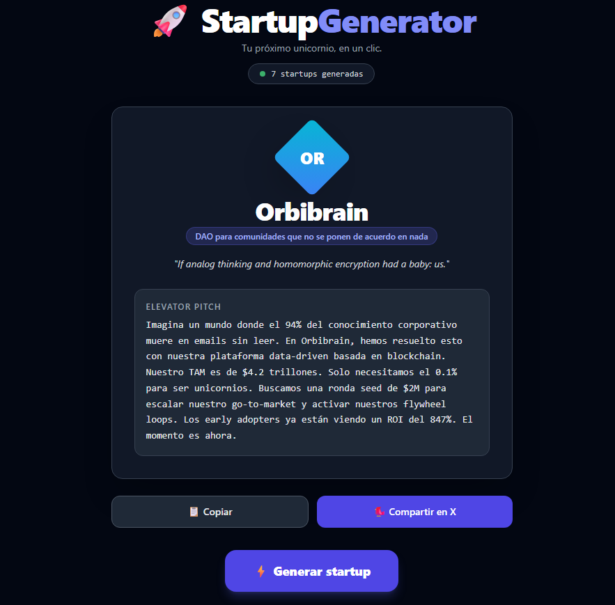

# 🚀 StartupGenerator

> Generate a complete (and completely absurd) startup in one click.




**StartupGenerator** is a fun, satirical web app that parodies startup culture. Hit a button and instantly get a randomly generated startup with a name, CSS-only logo, buzzword-filled slogan, and a pitch so convincing you might actually believe it.

No AI. No APIs. No investors. Just vibes.

---

## ✨ Features

- 🎲 **Random startup name** — Hundreds of prefix/root/suffix combinations
- 🎨 **CSS-only logo** — Geometric shapes with random gradients, no images needed
- 💬 **Buzzword slogan** — Templated nonsense that sounds disturbingly real
- 📢 **Elevator pitch** — A full 30-second pitch with TAM, moat, traction and more
- 🏷️ **Absurd sector** — "B2B SaaS for pets", "Web3 for retired people" and 37 more
- ⏳ **Loading animation** — Rotating messages like "Calculating TAM..." and "Hiring 3 ex-Googlers..."
- 📊 **Generation counter** — Tracks how many startups have been generated locally
- 🐦 **Share on X/Twitter** — One click to share your new empire with the world
- 📋 **Copy to clipboard** — Grab the full pitch in seconds

---
## 🖥️ Demo

> Coming soon — deploy link here

---

## 🛠️ Tech Stack

| Tool | Purpose |
|------|---------|
| [React 18](https://react.dev/) | UI framework |
| [Vite](https://vitejs.dev/) | Build tool & dev server |
| [Tailwind CSS v3](https://tailwindcss.com/) | Styling |
| localStorage | Persisting the generation counter |

No external APIs. Everything runs client-side.

---

## 🚀 Getting Started

### Prerequisites

- [Node.js](https://nodejs.org/) v18 or higher
- npm

### Installation

```bash
# Clone the repo
git clone https://github.com/your-username/startup-generator.git
cd startup-generator

# Install dependencies
npm install

# Start the dev server
npm run dev
```

Open [http://localhost:5173](http://localhost:5173) in your browser.

### Build for production

```bash
npm run build
```

The output will be in the `dist/` folder, ready to deploy anywhere (Vercel, Netlify, GitHub Pages, etc.).

---

## 📁 Project Structure

```
src/
├── components/
│   ├── LogoGenerator.jsx   # CSS-only logo with random shape & gradient
│   ├── StartupCard.jsx     # Main card displaying the generated startup
│   └── ShareButton.jsx     # Copy & share on X buttons
├── data/
│   ├── names.js            # Prefixes, roots and suffixes for name generation
│   ├── sectors.js          # 40 absurd startup sectors
│   ├── slogans.js          # Slogan templates and word banks
│   └── pitches.js          # Pitch templates and word banks
├── utils/
│   └── generator.js        # Core randomization logic
├── App.jsx                 # Main app with loading animation & counter
└── main.jsx                # Entry point
```

---

## 🤝 Contributing

Got a funny sector, slogan template or pitch idea? PRs are welcome.

1. Fork the repo
2. Create a branch: `git checkout -b feature/my-idea`
3. Add your content to the relevant file inside `src/data/`
4. Open a pull request

---

## 📄 License

MIT — do whatever you want with it.

---

> *No investors were harmed in the making of this app.*